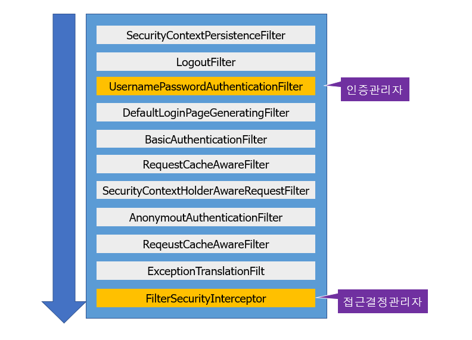

# SpringSessionCluster - Redis
## Redis
- [개발자를 위한 레디스 튜토리얼1](https://meetup.toast.com/posts/224)
- [개발자를 위한 레디스 튜토리얼2](https://meetup.toast.com/posts/225)
- [개발자를 위한 레디스 튜토리얼3](https://meetup.toast.com/posts/226)
- [개발자를 위한 레디스 튜토리얼4](https://meetup.toast.com/posts/227)
### Redis서버 실행
    $ docker run -p 6379:6379 --name cluster-redis -d redis
    # 내부 ip 확인
    $ docker describe <<container id>>
### Redis CLI 실행 및 session 정보확인
    $ docker run -it --network bridge --rm redis redis-cli -h <<continer ip>>
    xxx.xxx.x.x:6379> key *
    # session key 확인
    xxx.xxx.x.x:6379> hgetall spring:session:sessions:<<session id>>
## SpringSession
### SpringBoot initializr
    implementation 'org.springframework.boot:spring-boot-starter-data-redis'
    implementation 'org.springframework.boot:spring-boot-starter-web'
    implementation 'org.springframework.session:spring-session-data-redis'
    implementation 'org.springframework.boot:spring-boot-starter-security'
### @EnableRedisHttpSession
세션을 Reids로 관리하는 허용하는 어노테이션이며 AbstractHttpSessionApplicationInitializer상속 받아 구현.

    @Configurable
    @EnableRedisHttpSession(maxInactiveIntervalInSeconds = 60)
    public class RedisHttpSessionConfiguartion extends AbstractHttpSessionApplicationInitializer {
        public RedisHttpSessionConfiguartion(){
             super(RedisHttpSessionConfiguartion.class);
         }
         ...
> **Tip**: Redis CLI 실행 및 session 정보확인 참조. 세션만료키는 30분+5분으로 설졍됨. 이유는 세션삭제되는 찰나에 접근하여 사용하는 경우를 대비한다고 나와있음.
## SpringSecurty
SpringSecurity의 Filter

 - SecurityContextPersistenceFilter : SecurityContextRepository에서 SecurityContext를 로드하고 저장하는 일을 담당함
 - LogoutFilter : 로그아웃 URL로 지정된 가상URL에 대한 요청을 감시하고 매칭되는 요청이 있으면 사용자를 로그아웃시킴 
 - UsernamePasswordAuthenticationFilter : 사용자명과 비밀번호로 이뤄진 폼기반 인증에 사용하는 가상 URL요청을 감시하고 요청이 있으면 사용자의 인증을 진행함 
 - DefaultLoginPageGeneratingFilter : 폼기반 또는 OpenID 기반 인증에 사용하는 가상URL에 대한 요청을 감시하고 로그인 폼 기능을 수행하는데 필요한 HTML을 생성함 
 - BasicAuthenticationFilter : HTTP 기본 인증 헤더를 감시하고 이를 처리함 
 - RequestCacheAwareFilter : 로그인 성공 이후 인증 요청에 의해 가로채어진 사용자의 원래 요청을 재구성하는데 사용됨 
 - SecurityContextHolderAwareRequestFilter : HttpServletRequest를 HttpServletRequestWrapper를 상속하는 하위 클래스(SecurityContextHolderAwareRequestWrapper)로 감싸서 필터 체인상 하단에 위치한 요청 프로세서에 추가 컨텍스트를 제공함 AnonymousAuthenticationFilter 이 필터가 호출되는 시점까지 사용자가 아직 인증을 받지 못했다면 요청 관련 인증 토큰에서 사용자가 익명 사용자로 나타나게 됨 
 - SessionManagementFilter : 인증된 주체를 바탕으로 세션 트래킹을 처리해 단일 주체와 관련한 모든 세션들이 트래킹되도록 도움 
 - ExceptionTranslationFilter : 이 필터는 보호된 요청을 처리하는 동안 발생할 수 있는 기대한 예외의 기본 라우팅과 위임을 처리함 
 - FilterSecurityInterceptor : 이 필터는 권한부여와 관련한 결정을 AccessDecisionManager에게 위임해 권한부여 결정 및 접근 제어 결정을 쉽게 만들어 줌

출처: https://devuna.tistory.com/55 [튜나 개발일기📚]
### SpringSecurityConfiguation
@EnableWebSecurity 애너테이션은 웹 보안을 활성화 하며, WebSecurityConfigurer를 구현하거나 WebSecurityConfigurerAdapter를 확장해서 설정
아래 세가지 configure() 메소드를 오버라이딩하고 동작을 설정하는 것으로 웹 보안을 설정.    
 - configure(WebSecurity) : 스프링 시큐리티의 필터 연결을 설정하기 위한 오버라이딩이다
 - configure(HttpSecurity) : 인터셉터로 요청을 안전하게 보호하는 방법을 설정하기 위한 오버라이딩이다
 - configure(AuthenticationManagerBuilder) : 사용자 세부 서비스를 설정하기 위한 오버라이딩이다(Login사용자)
```
    @Configuration
    @EnableWebSecurity
    @RequiredArgsConstructor
    public class SecurityConfiguration extends WebSecurityConfigurerAdapter {
        ...
            @Override
            protected void configure(AuthenticationManagerBuilder auth) throws Exception {
                auth.inMemoryAuthentication()
                        .withUser("user").password(passwordEncoder.encode("1")).roles("USER")
                        .and()
                        .withUser("admin").password(passwordEncoder.encode("2")).roles("ADMIN");
            }
            @Override
            protected void configure(HttpSecurity http) throws Exception {
                http.csrf().disable()
                        .authorizeRequests()
                        .antMatchers("/admin/**").hasRole("ADMIN")
                        .antMatchers("/anonymous*").anonymous()
                        .anyRequest().authenticated();
        
                http.formLogin()
                        .defaultSuccessUrl("/", true)
                        .and()
                        .logout()
                        .logoutUrl("/logout");
            }
```
> **Tip**: auth.inMemoryAuthentication()는 테스트 용도로만 사용됨.
#### AuthenticationManagerBuilder
인증을 위한 여러가지 방법은 [혀노블로그](https://m.blog.naver.com/kimnx9006/220634017538)를 참조.
DataSource로 인증 예시
```
        ...
            @Override
            protected void configure(AuthenticationManagerBuilder auth) throws Exception {
                auth.jdbcAuthentication()
                    .dataSource(dataSource)
                    .usersByUsernameQuery("select username, password, true from esauser u where username=?")
                    .authoritiesByUsernameQuery("select username, 'ROLE_USER' from esarole where username=?")
                    .passwordEncoder(new StandardPasswordEncoder("53cr3t"));
            }
        ...
```
사용자 정의 서비스 설정 - UserDetailsServce인터페이스를 구현하고 아래와 같이 설정.
```
        ...
            @Override
            protected void configure(AuthenticationManagerBuilder auth) throws Exception {
                auth.userDetailsService(new UserService(userRepository));
            }
        ...
```